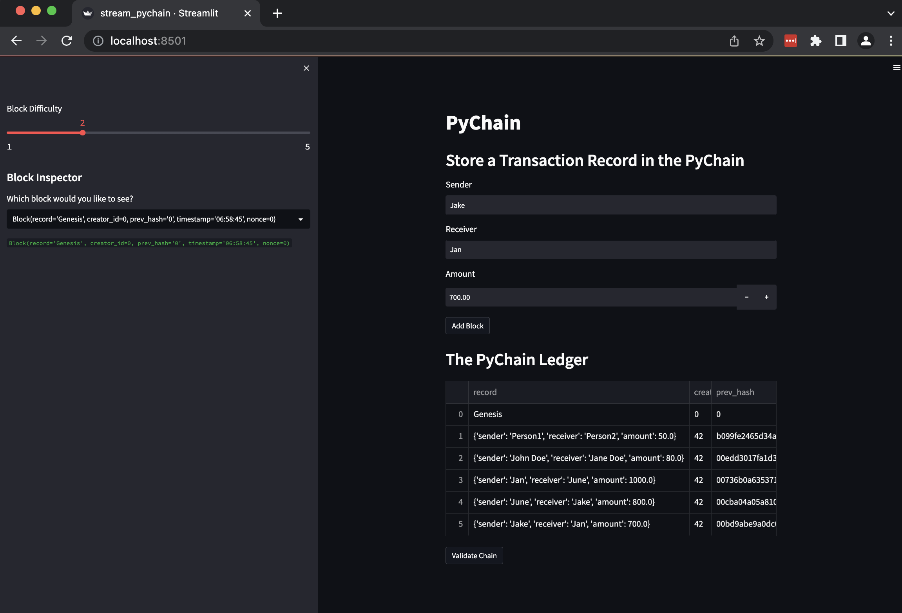
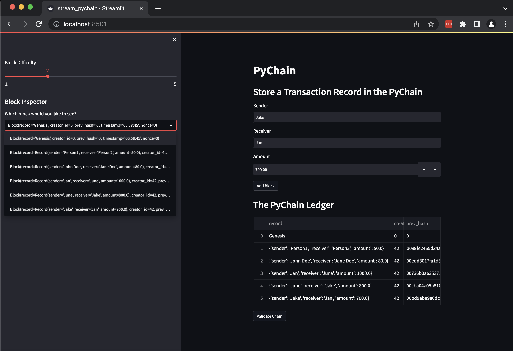
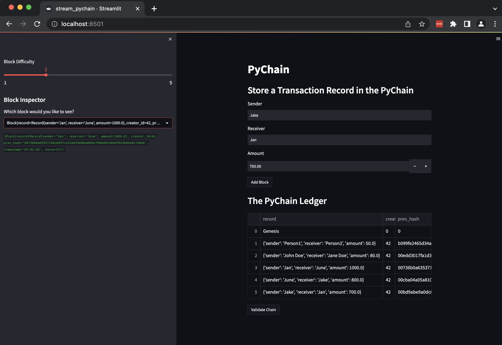
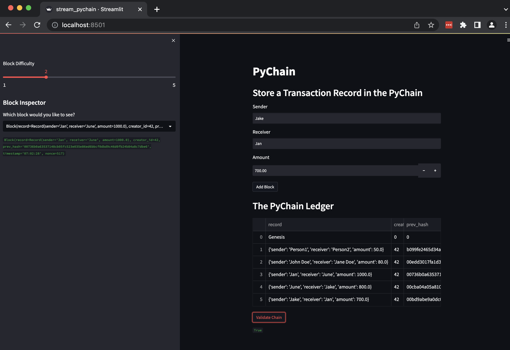

# PyChain
Blockchain-based ledger system, with a user-friendly web interface implemented in Streanmlit. This ledger allows user to transfer money between senders and receivers, and to verify the integrity of the data in the ledger.

## Technologies

This project uses python 3.9 with the following:

* [jupyter](https://jupyter.org/)

* [pandas](https://pandas.pydata.org/)

* [hashlib](https://docs.python.org/3/library/hashlib.html)

* [streamlit](https://streamlit.io/)


## Usage

Ensure that all dependencies are installed
```
pip install streamlit
```

Run the streamlit application.
```
streamlit run stream_pychain.py
```

Upon capturing input and clicking `Add Block`, the data will be added to the ledger.


The left portion of the page, allows inspection of available blocks.


Upon selecting a block from the left drop down, it will show the selected block.


In the lower right portion of the screen, an option to validate the block.



## Contributors

Contributed by [Theena Dang](maria.cristina.dang@gmail.com)

---

## License

[MIT](LICENSE)
